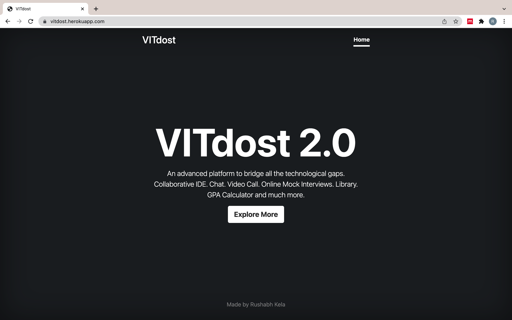
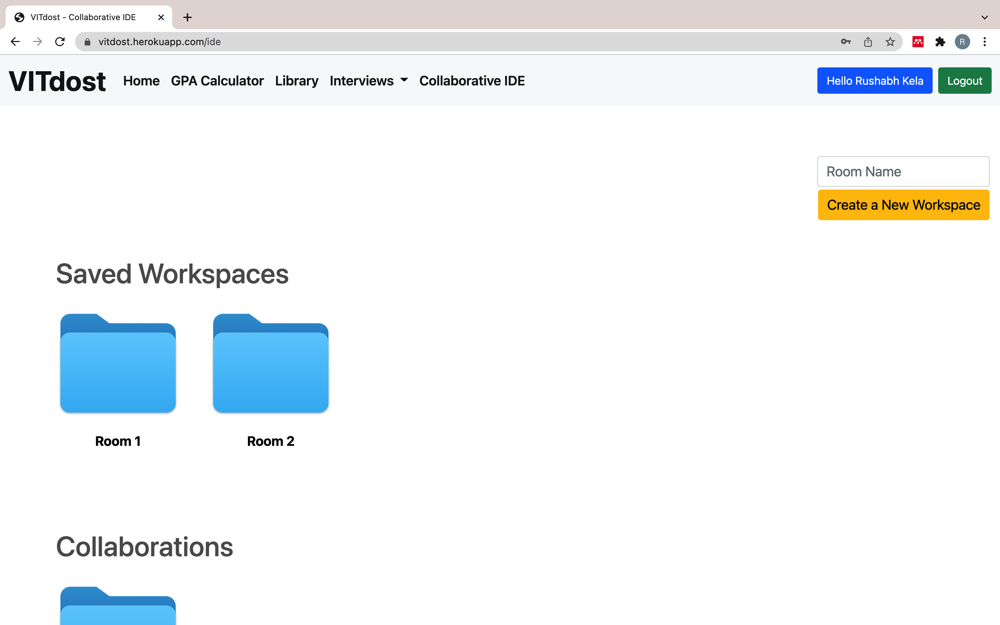
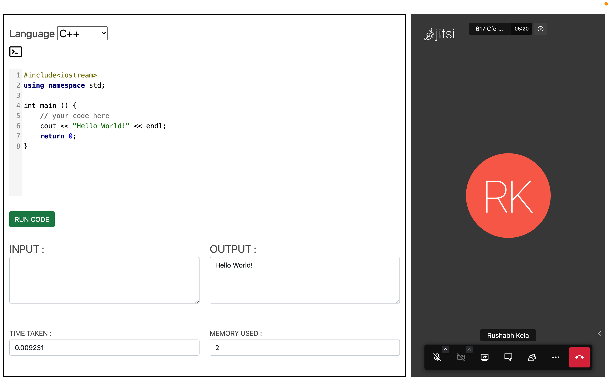
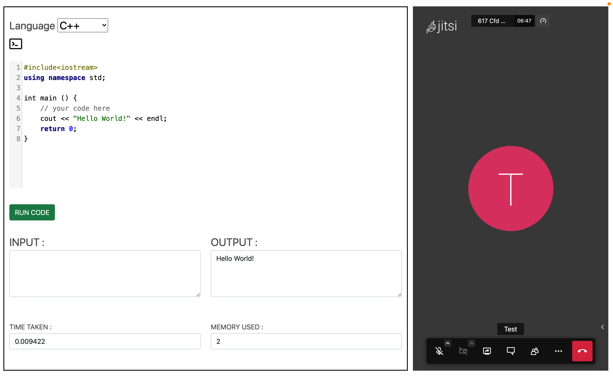
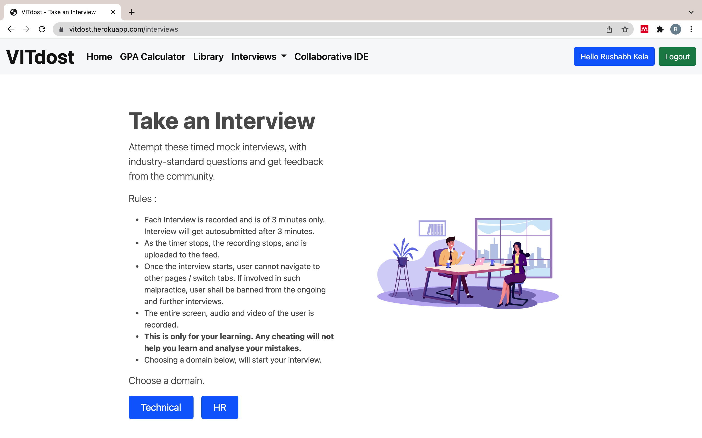
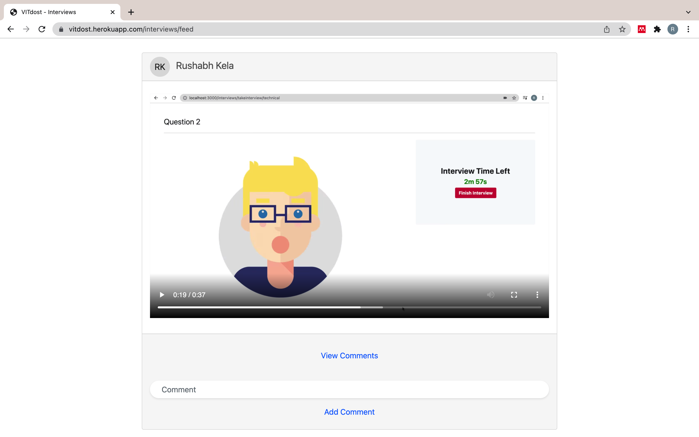
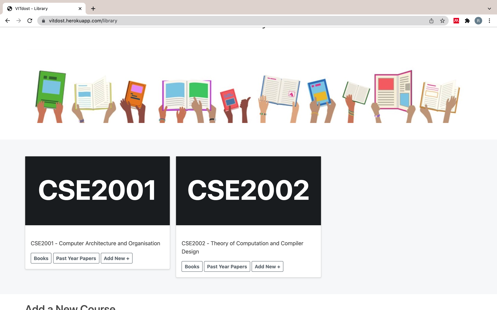
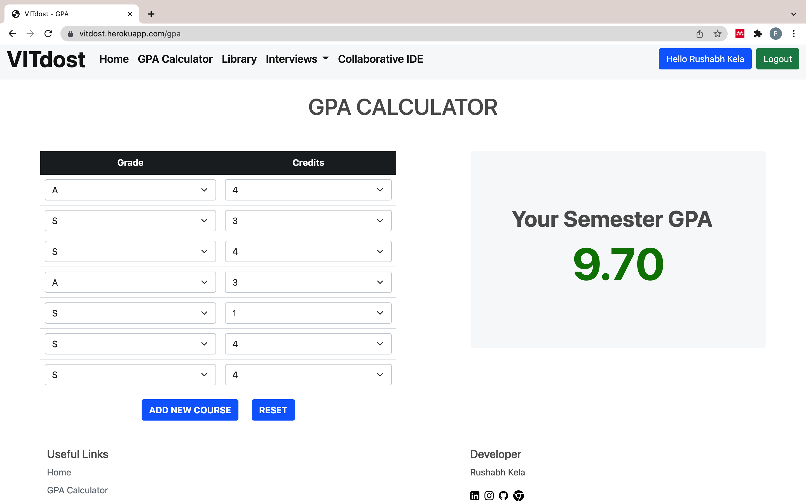

<div id="top"></div>

<br />
<div align="center">
  <a href="https://github.com/rushabhkela/VITdost">
    
  </a>

  <h3 align="center">VITdost</h3>

  <p align="center">
    A Fully-Featured Advanced Educational Platform
    <br />
    <a href="https://github.com/rushabhkela/VITdost"><strong>Explore the docs »</strong></a>
    <br />
    <br />
    <a href="https://vitdost.herokuapp.com">View Demo</a>
    ·
    <a href="https://github.com/rushabhkela/VITdost/issues">Report Bug</a>
    ·
    <a href="https://github.com/rushabhkela/VITdost/pulls">Request Feature</a>
  </p>
</div>


<!-- TABLE OF CONTENTS -->
<details>
  <summary>Table of Contents</summary>
  <ol>
    <li>
      <a href="#about-the-project">About The Project</a>
      <ul>
        <li><a href="#built-with">Built With</a></li>
      </ul>
    </li>
    <li>
      <a href="#getting-started">Getting Started</a>
      <ul>
        <li><a href="#prerequisites">Prerequisites</a></li>
        <li><a href="#installation">Installation</a></li>
      </ul>
    </li>
    <li><a href="#usage">Usage</a></li>
    <li><a href="#roadmap">Roadmap</a></li>
    <li><a href="#contributing">Contributing</a></li>
    <li><a href="#license">License</a></li>
    <li><a href="#contact">Contact</a></li>
    <li><a href="#acknowledgments">Acknowledgments</a></li>
  </ol>
</details>


<!-- ABOUT THE PROJECT -->
## About The Project



**VITdost was initially launched in July 2021. VITdost 2.0 is an upgraded version, bigger and better.**
<br>

**VITdost is an advanced platform to bridge all the technological gaps. Designed specifically for VITians, this platform includes features like :**
1. **A Collaborative IDE** - Due to the COVID-19 pandemic, all of us are at different parts of the world. Peer - Coding is not the same as before. But wait, this IDE is different, here you can chat and video call, form a group, and code collaboratively in real-time. Whatever you code is visible to your entire team simultaneously in real-time. It simple to use - login, create a new workspace and add collaborators or use a saved one, and start coding.

2. **Interviews** - Online Placements ? Have to give an interview in front of a bot ? Sounds crazy, but thats what a lot of companies are adopting in their hybrid recruitment procedures. This platform provides a mock timed - online interview practice with industry standard questions. Choose a domain (technical / HR), take 1 min to prepare for the question, and give your best in the 3 minutes of your answering time. Once the interview is completed, your video is uploaded to the feed, where other users can give feedback and commennt on it.

3. **Library** - A library made for VITians, by the VITians. Upload your study materials, books, past - year papers.

4. **GPA Calculator** - This feature tells you what your semester GPA would be on the combination of grades you put with the number of credits. So set your goal and the start and work for it.


<p align="right">(<a href="#top">back to top</a>)</p>


### Built With

This project was built with the following frameworks and technologies:

* [Node.js](https://nodejs.org/en/)
* [Express Framework](https://expressjs.com/)
* [MongoDB](https://www.mongodb.com/)
* [Bootstrap](https://getbootstrap.com)
* [Javascript](https://www.w3schools.com/js/)
* [AWS S3 Storage (for study materials, interview videos)](https://aws.amazon.com/)
* [MediaStream Recording API](https://developer.mozilla.org/en-US/docs/Web/API/MediaStream_Recording_API)
* [Socket.IO](https://socket.io/)
* [Jitsi Meet API](https://jitsi.org/api/)
* [Hackerearth API](https://www.hackerearth.com/docs/wiki/developers/v4/)
* [Twilio SendGrid API](https://www.twilio.com/sendgrid/email-api)


<p align="right">(<a href="#top">back to top</a>)</p>


<!-- GETTING STARTED -->
## Getting Started

Follow the steps given below to run the project locally on your system.

### Prerequisites

* npm
  ```sh
  npm install npm@latest -g
  npm install nodemon@latest -g
  ```

### Installation

_Once all the prerequisites are met, the required API Keys must be generated and dependencies must be installed._

1. Get Amazon S3 Client Credentials at [https://aws.amazon.com/](https://aws.amazon.com/)
2. Create a bucket in the AWS S3 Storage console for library and interview uploads.
3. Create a free MongoDB Atlas cluster at [https://www.mongodb.com/atlas](https://www.mongodb.com/atlas)
4. Get a free Hackerearth API v4 key at [https://www.hackerearth.com/docs/wiki/developers/v4/](https://www.hackerearth.com/docs/wiki/developers/v4/)
5. Generate a mock email ID through which emails can be sent to users of the website.
6. Create a Twilio SendGrid API key from [https://www.twilio.com/sendgrid/email-api](https://www.twilio.com/sendgrid/email-api). This is required, as to add collaborators to a workspace, they are invited using email.

7. Clone the repo
   ```sh
   git clone https://github.com/rushabhkela/VITdost.git
   ```
3. Install NPM packages
   ```sh
   npm install
   ```
4. Create the .env file
   ```sh
   cp .env.example .env
   ```
5. In the .env file, enter your credentials generated in the above steps and add a suitable session-key.
6. Good to go! Start the project locally using the following command, and go to [http://localhost:3000](http://localhost:3000)
   ```sh
   npm start
   ```

<p align="right">(<a href="#top">back to top</a>)</p>


<!-- USAGE EXAMPLES -->
## Usage
### Collaborative IDE

<div align="center">
    
    
    
    <br>
</div>

### Interview Platform

<div align="center">
    
    
    <br>
</div>

### Library

<div align="center">
    
    <br>
</div>


### GPA Calculator

<div align="center">
    
    <br>
</div>

<p align="right">(<a href="#top">back to top</a>)</p>


<!-- ROADMAP -->
## Roadmap

- [x] Think of a unique idea!
- [x] Implement the project.
- [x] Add a README.md
- [x] Deploy the project
- [ ] Expand the scope of the project, implement new ideas.
    - [ ] Add a user profile

See the [open issues](https://github.com/rushabhkela/VITdost/issues) for a full list of proposed features (and known issues).

<p align="right">(<a href="#top">back to top</a>)</p>


<!-- CONTRIBUTING -->
## Contributing

Contributions are what make the open source community such an amazing place to learn, inspire, and create. Any contributions you make are **greatly appreciated**.

If you have a suggestion that would make this better, please fork the repo and create a pull request. You can also simply open an issue with the tag "enhancement".
Don't forget to give the project a star! Thanks again!

1. Fork the Project
2. Create your Feature Branch (`git checkout -b feature/AmazingFeature`)
3. Commit your Changes (`git commit -m 'Add some AmazingFeature'`)
4. Push to the Branch (`git push origin feature/AmazingFeature`)
5. Open a Pull Request

<p align="right">(<a href="#top">back to top</a>)</p>


<!-- LICENSE -->
## License

This project is licensed under the Apache 2.0 License. See `LICENSE` for more information.

<p align="right">(<a href="#top">back to top</a>)</p>


<!-- CONTACT -->
## Contact

Rushabh Kela - +91 9834473257 - kelarushabh@gmail.com

Project Link: [https://github.com/rushabhkela/VITdost](https://github.com/rushabhkela/VITdost)

<p align="right">(<a href="#top">back to top</a>)</p>


<!-- ACKNOWLEDGMENTS -->
## Acknowledgments

* [Choose an Open Source License](https://choosealicense.com)
* [Font Awesome](https://fontawesome.com)
* [Operational Transformation](https://github.com/Operational-Transformation/ot.js/)
* [Hackerearth API v4](https://www.hackerearth.com/docs/wiki/developers/v4/)
* [AWS, MediaStream Recording API documentations](https://developer.mozilla.org/en-US/docs/Web/API/MediaRecorder)

<p align="right">(<a href="#top">back to top</a>)</p>
